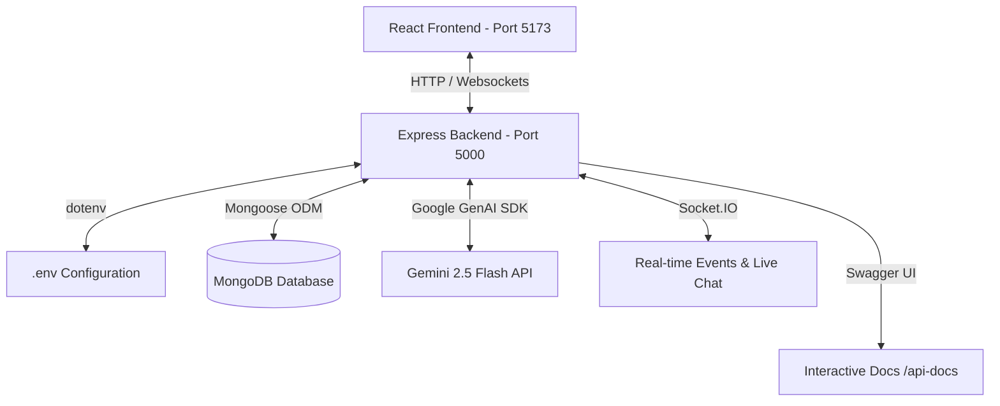

# 🚀 TalentBridge Portal

[](https://nodejs.org/)
[](https://expressjs.com/)
[](https://react.dev/)
[](https://vite.dev/)
[](https://www.mongodb.com/)
[](https://www.docker.com/)
[](https://swagger.io/)

TalentBridge is an advanced, full-stack recruiter-and-candidate matching portal. It streamlines job posting, candidate discovery, multi-stage application pipelines, and real-time communication.

---

## 📌 Table of Contents
1. [Core Features](#-core-features)
2. [Tech Stack](#%EF%B8%8F-tech-stack)
3. [Architecture Overview](#-architecture-overview)
4. [Interactive API Docs (Swagger)](#-interactive-api-docs-swagger)
5. [Setup & Installation](#%EF%B8%8F-setup--installation)
   - [Method A: Docker Compose (Recommended)](#method-a-docker-compose-recommended)
   - [Method B: Local Setup (Manual)](#method-b-local-setup-manual)
6. [Environment Configuration](#%EF%B8%8F-environment-configuration)
7. [API Management System](#-api-management-system)
8. [UI Routing Matrix](#-ui-routing-matrix)
9. [Troubleshooting & FAQ](#-troubleshooting--faq)

---

## 🌟 Core Features

### 👥 Dual-Portal Roles (RBAC)
* **Candidates**: Build profile, upload resumes, browse jobs with filters, submit applications, check application status history, and chat in real-time with recruiters.
* **Recruiters**: Post/manage job listings, search candidates using robust filters, track applications, update candidate statuses, download resumes, and instantly initiate chat with applicants.

### 🧠 AI-Powered Resume Scoring
* Integrated with Google's latest **Gemini AI model** (`gemini-2.5-flash`).
* Automatically parses uploaded candidate PDF resumes upon application submission.
* Scores the match profile from `0` to `100` against the job description and required skills.

### 🛡️ Optimistic Concurrency Control & Audit Trails
* **Audit Trails**: Every stage of an application (`screening`, `interviewing`, `offered`, `hired`, `rejected`) is logged in a persistent history log recording *who*, *when*, and *why*.

### 💬 Real-Time Socket Notifications & Chat
* Real-time notifications push application status updates instantly using **Socket.IO**.
* Supports fully-featured, instantaneous 1:1 text chat sessions including technical OA links and interview invites.

### 📖 Interactive Swagger OpenAPI
* Fully self-documenting REST API with schema specifications and live "Try it out" capabilities.

---

## 🛠️ Tech Stack

* **Frontend**: React 19, Vite 8, React Router DOM v7, Axios, Socket.io-client.
* **Backend**: Node.js, Express.js (v5), Mongoose, Socket.io, Multer, PDF-Parse, `@google/genai` SDK.
* **Database**: MongoDB (Atlas Cloud or Containerized Local).
* **Containerization**: Docker Compose (multi-container setup with hot-reloading).

---

## 🏗️ Architecture Overview



---

## 📖 Interactive API Docs (Swagger)

The server exposes a production-ready interactive **Swagger/OpenAPI 3.0** documentation portal. You can browse all endpoints, view detailed request/response schemas, and execute live calls (using JWT Bearer tokens).

* **API Docs URL**: `http://127.0.0.1:5000/api-docs`

---

## ⚙️ Setup & Installation

Ensure you have [Docker](https://www.docker.com/) (or [Node.js v20+](https://nodejs.org/) and [MongoDB](https://www.mongodb.com/)) installed.

### Method A: Docker Compose (Recommended)
This runs the entire stack inside containers with hot-reloading enabled. Dependencies are isolated automatically.

1. Ensure your backend environment file exists at `./server/.env` (see config below).
2. Start the multi-container stack:
   ```bash
   docker compose up -d
   ```
3. The services will boot up:
   * **Frontend Application**: [http://localhost:5173](http://localhost:5173)
   * **Backend API server**: [http://localhost:5000](http://localhost:5000)
   * **Swagger Portal**: [http://127.0.0.1:5000/api-docs](http://127.0.0.1:5000/api-docs)

To stop the containers:
```bash
docker compose down
```

---

### Method B: Local Setup (Manual)

#### 1. Install Dependencies
```bash
# Install server dependencies
cd server && npm install

# Install client dependencies
cd ../client && npm install
```

#### 2. Run the Applications
Start the backend server:
```bash
cd server
npm start
```

Start the frontend application (in a new terminal):
```bash
cd client
npm run dev
```

---

## ⚙️ Environment Configuration

### Backend Setup (`server/.env`)
Create a `.env` file in the `server/` directory and configure the following variables:

```env
# Server Port (Defaults to 5000)
PORT=5000

# MongoDB URI (Atlas cloud or local container)
MONGO_URI=mongodb+srv://<username>:<password>@cluster0.mongodb.net/talentbridge

# JWT Secret (For signing authentication tokens)
JWT_SECRET=your_super_secure_random_key_here

# Google Gemini API Key (For AI resume match scoring)
GOOGLE_API_KEY=your_gemini_api_key_here
```

### Docker compose Integration
To load your `.env` variables into the Docker services, ensure `env_file` is defined in your `docker-compose.yml`:
```yaml
  server:
    env_file:
      - ./server/.env
```

---

## 🗺️ API Management System

To keep standard API configurations clean, the frontend keeps a single source of truth for endpoints, avoiding hardcoded values scattered in code:

* **Endpoint Mapping**: [client/src/api.json](file:///Users/prayag/dev/TalentBridge/client/src/api.json) contains all route configurations and HTTP methods.
* **Axios Provider**: [client/src/services/api.js](file:///Users/prayag/dev/TalentBridge/client/src/services/api.js) exports the interceptor instance, handles JWT injection, and exposes typed functions for all endpoints.

---

## 🗺️ UI Routing Matrix

The React frontend utilizes RBAC to restrict page navigation:

* **Public Routes** (Anyone)
  * `/jobs` — Browse jobs with keyword and skill filters.
  * `/jobs/:id` — Detailed job description and specs.
  * `/login` & `/register` — Account login & role creation.
* **Candidate Only**
  * `/candidate-dashboard` — Profile metrics and recommended jobs.
  * `/my-applications` — Status tracker and resume update portal.
* **Recruiter Only**
  * `/recruiter-dashboard` — Candidate application tracking, active jobs.
  * `/jobs/new` — Job creation form.
  * `/candidates` — Candidate index search.
  * `/candidates/:id` — Full details of candidate profiles.
* **Shared Authed**
  * `/profile` — View/edit basic profile data and change password.
